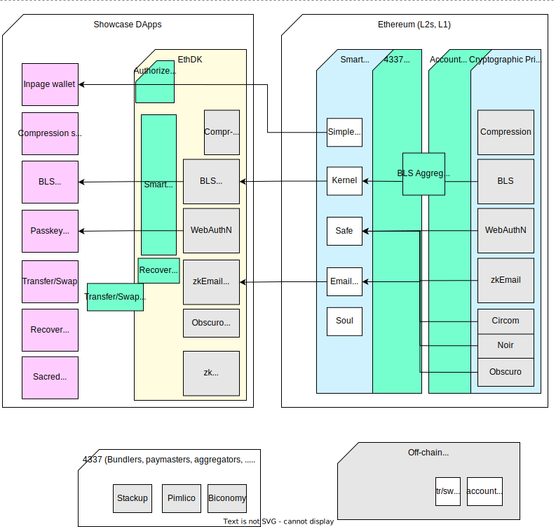

# Wallet Account eXperiments (WAX)
## Overview
Team WAX wants to see more applications readily benefiting from decentralised technologies, via a smooth journey across unfamiliar technical barriers.

WAX seeks to achieve this with a three pronged approach:
1. Showcase, via examples, the benefits of cryptographic primitives in smart accounts
   - including examples of novel use cases that compose smart account modules
2. Develop an easy-to-use opinionated SDK ("EthDK") that makes integrating these benefits easy for non-web3 devs
3. Provide a focused dev environment for the integration of more primitives into smart accounts

## Components
The showcase dApps are comprised of application specific code (pink) that leverages the EthDK (yellow).
The EthDK contains the off-chain companion of corresponding on-chain cryptographic primitives (grey).
Existing smart accounts will be used to demonstrate integration of the primitives in 4337-compatible verification logic.

**Diagram**: current explorations and proposed development

- The green areas are WAX's focus.
- Within the EthDK there will be additions that enable projects to readily adopt novel features. 
- On-chain, between smart contracts and primitives, the verification data+logic will be designed to be composable. Smart accounts can then dynamically benefit from more than one primitive, and this will be developed in sync with broader smart account modularisation.

# Using this monorepo
## /webExamples
You're a web dev and want to bring the latest web3 capabilities to your product/users.
Here you will not only find 'hello world' wrappers of base primitives, but also composite examples highlighting novel product features.

### EthDK (imported)
The EthDK repo is useful for SDK devs who also want to support interaction with the bleeding edge of smart account verification capabilities.

## /contracts
You're a smart account dev and would like to integrate new primitives
New verification schemes are integrated into existing open smart accounts here.
This is where modularised byte verification is developed.

## /primitives
You've built a cryptographic primitive, and would like to integrate it as a smart account validation mechanism.
Use this to battle-test your primitive in isolation towards smart account integration (via modular verification).
