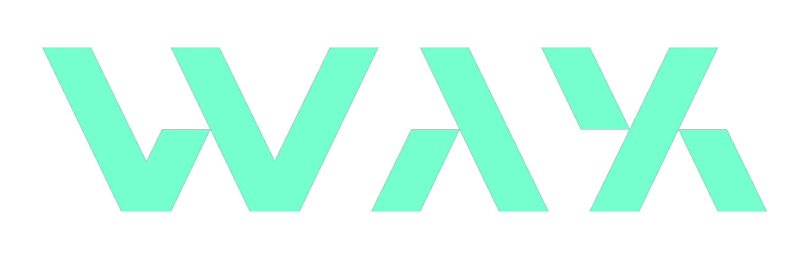

# Wallet Account eXperiments (WAX)

TODO Rephrase/update

WAX's goal is to deliver set of production-ready components that help developers easily utilise cryptographic primitives in smart accounts

We seek to achieve this with a three pronged approach:
1. Showcase, via examples, the benefits of cryptographic primitives in smart accounts
   - including examples of novel use cases that compose smart account modules
2. Provide a focused dev environment for the integration of more primitives into smart accounts

# Using this monorepo

[packages](./packages)

Majority of WAX projects including modules, demos, & other utilities

[archive](./archive/)

Work & projects that are no longer used but could be useful as references
